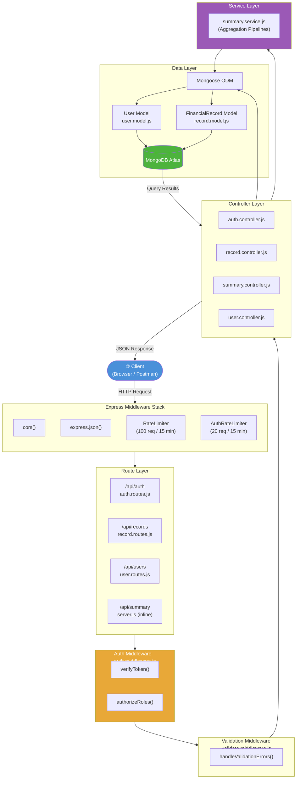
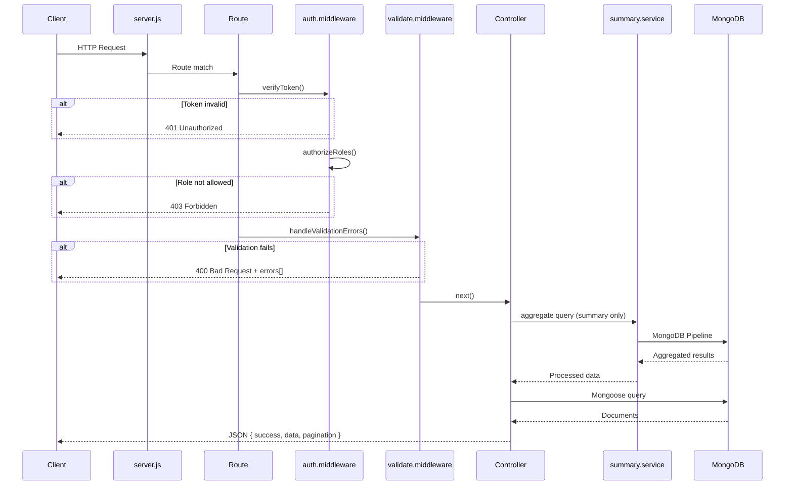
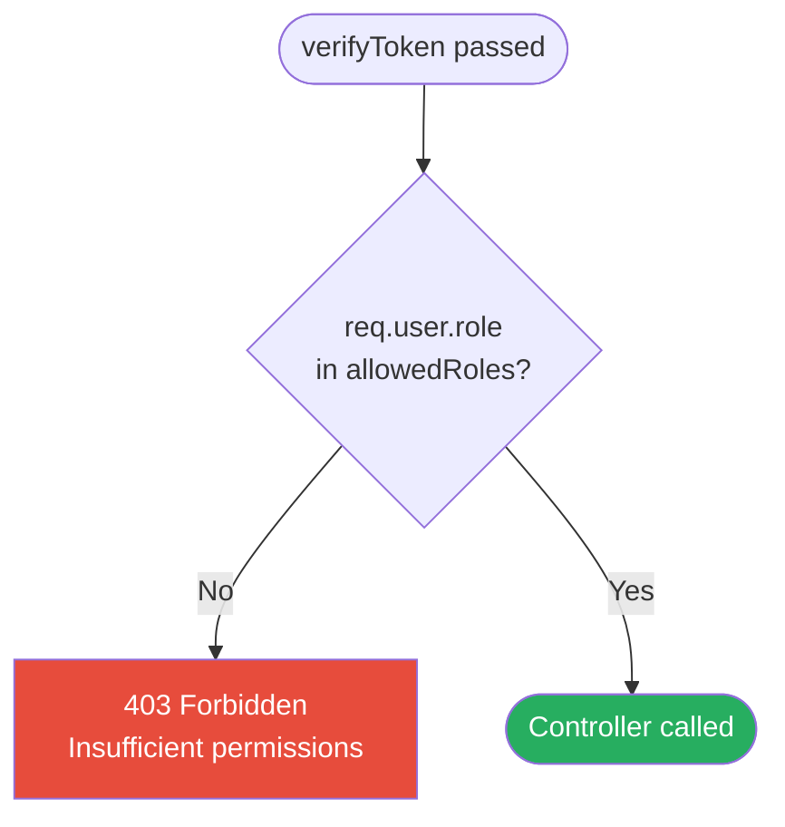
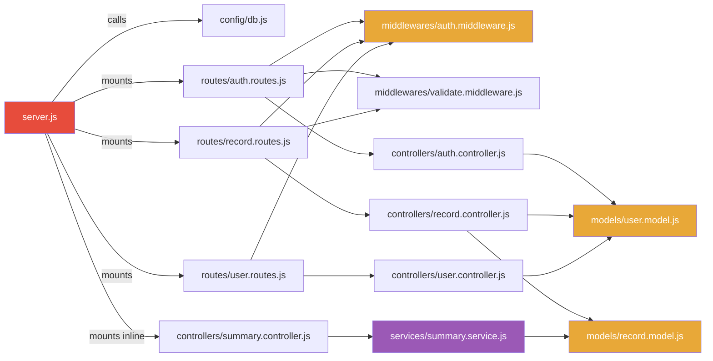
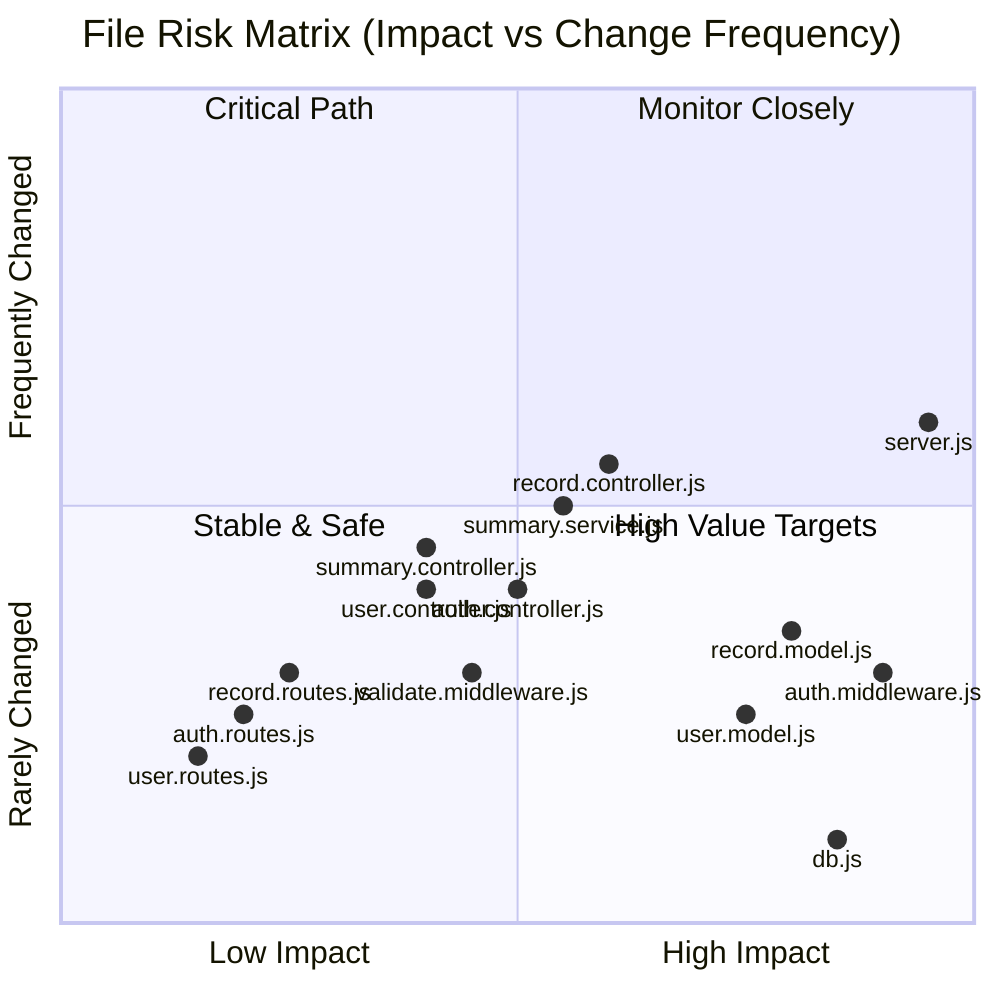
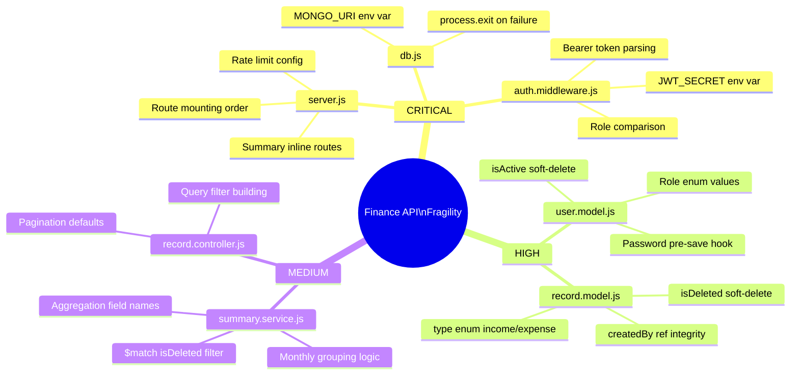
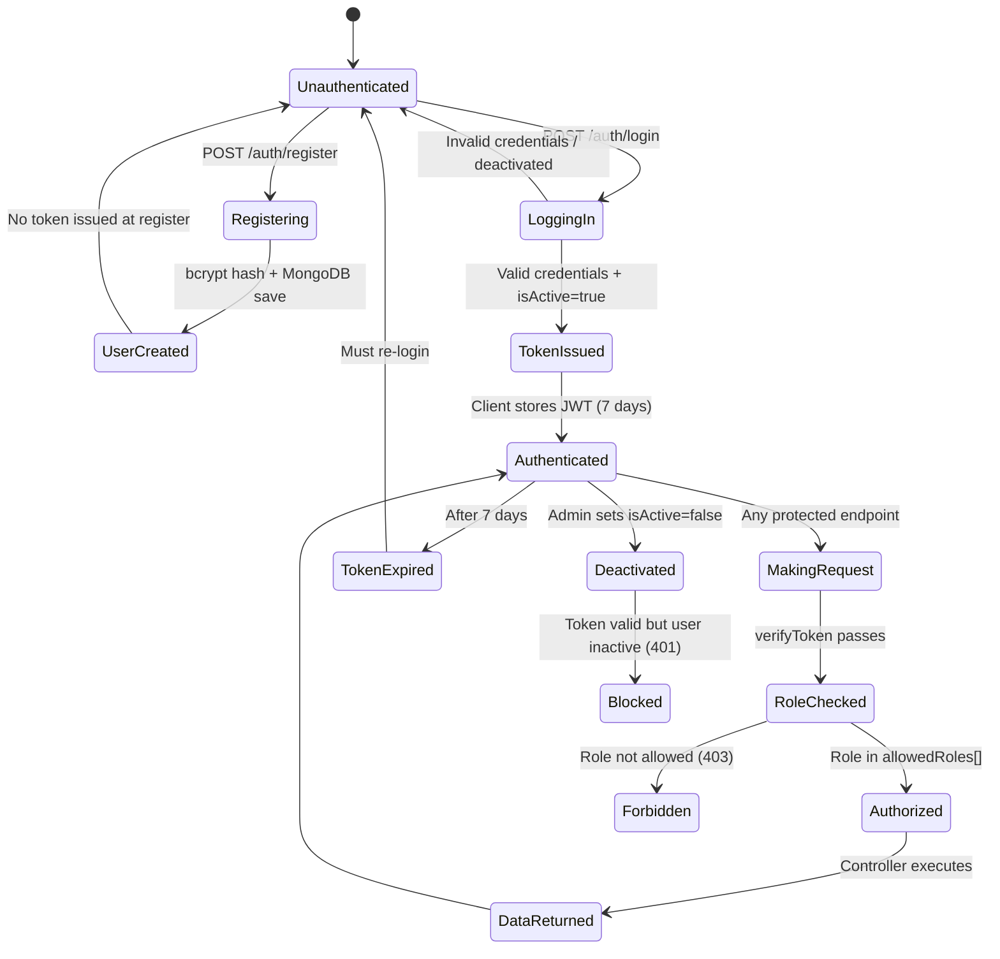
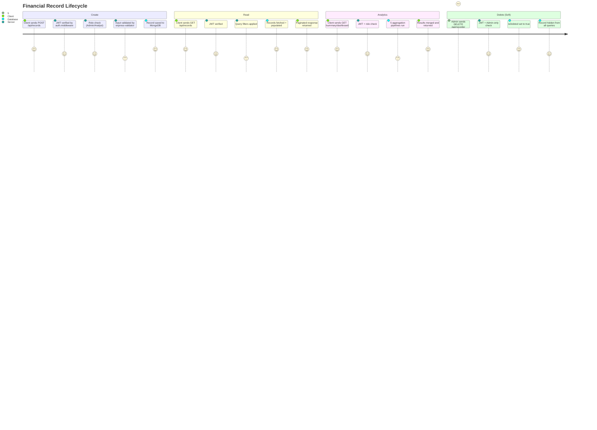

# Finance Dashboard Backend — Mindmap

<!-- AUTO-UPDATE: mindmap -->
<!-- Generated: 2026-04-27 | Repo: 007rahulM/Finance-Dashboard-Backend -->

---

## Table of Contents

1. [Architecture Overview](#1-architecture-overview)
2. [API Endpoints & File Handlers](#2-api-endpoints--file-handlers)
3. [Database Models & Relationships](#3-database-models--relationships)
4. [Authentication / Authorization Flow](#4-authentication--authorization-flow)
5. [Impact Matrix](#5-impact-matrix)
6. [High-Risk Zones](#6-high-risk-zones)
7. [Data Processing Pipeline](#7-data-processing-pipeline)

---

## 1. Architecture Overview

### System Data Flow



### Component Responsibilities

| Component | File(s) | Responsibility |
|-----------|---------|----------------|
| Entry Point | `server.js` | Express setup, rate limiting, route mounting |
| DB Config | `src/config/db.js` | MongoDB connection via Mongoose |
| Models | `src/models/*.js` | Schema definitions, Mongoose ODM |
| Routes | `src/routes/*.js` | URL mapping, middleware chaining |
| Controllers | `src/controllers/*.js` | HTTP request/response handling |
| Services | `src/services/summary.service.js` | Complex aggregation logic |
| Middlewares | `src/middlewares/*.js` | JWT auth, input validation |

---

## 2. API Endpoints & File Handlers

<!-- AUTO-UPDATE: endpoints -->

### Auth Endpoints (`/api/auth`)

| Method | Endpoint | Route File | Controller | Auth Required | Roles |
|--------|----------|-----------|------------|:-------------:|-------|
| POST | `/api/auth/register` | `auth.routes.js` | `auth.controller.js → register()` | ❌ | Public |
| POST | `/api/auth/login` | `auth.routes.js` | `auth.controller.js → login()` | ❌ | Public |
| GET | `/api/auth/profile` | `auth.routes.js` | `auth.controller.js → getProfile()` | ✅ JWT | Any authenticated |

### Financial Record Endpoints (`/api/records`)

| Method | Endpoint | Route File | Controller | Auth Required | Roles |
|--------|----------|-----------|------------|:-------------:|-------|
| POST | `/api/records` | `record.routes.js` | `record.controller.js → createRecord()` | ✅ JWT | Admin, Analyst |
| GET | `/api/records` | `record.routes.js` | `record.controller.js → getAllRecords()` | ✅ JWT | Any authenticated |
| GET | `/api/records/:id` | `record.routes.js` | `record.controller.js → getRecordById()` | ✅ JWT | Any authenticated |
| PUT | `/api/records/:id` | `record.routes.js` | `record.controller.js → updateRecord()` | ✅ JWT | Admin, Analyst |
| DELETE | `/api/records/:id` | `record.routes.js` | `record.controller.js → deleteRecord()` | ✅ JWT | Admin only |

### Summary / Analytics Endpoints (`/api/summary`)

| Method | Endpoint | Route File | Controller | Auth Required | Roles |
|--------|----------|-----------|------------|:-------------:|-------|
| GET | `/api/summary/dashboard` | `server.js` | `summary.controller.js → getDashboardSummary()` | ✅ JWT | Admin, Analyst |
| GET | `/api/summary/trends` | `server.js` | `summary.controller.js → getMonthlyTrends()` | ✅ JWT | Admin, Analyst |

### User Management Endpoints (`/api/users`)

| Method | Endpoint | Route File | Controller | Auth Required | Roles |
|--------|----------|-----------|------------|:-------------:|-------|
| GET | `/api/users` | `user.routes.js` | `user.controller.js → getAllUsers()` | ✅ JWT | Admin only |
| GET | `/api/users/:id` | `user.routes.js` | `user.controller.js → getUserById()` | ✅ JWT | Admin only |
| PUT | `/api/users/:id` | `user.routes.js` | `user.controller.js → updateUser()` | ✅ JWT | Admin only |
| DELETE | `/api/users/:id` | `user.routes.js` | `user.controller.js → deleteUser()` | ✅ JWT | Admin only |

<!-- END: endpoints -->

### Endpoint Request/Response Flow



---

## 3. Database Models & Relationships

<!-- AUTO-UPDATE: models -->

### User Model (`src/models/user.model.js`)

| Field | Type | Constraints | Notes |
|-------|------|-------------|-------|
| `username` | String | required, unique, minLength: 3 | Trimmed |
| `email` | String | required, unique, lowercase | Regex validated |
| `password` | String | required, minLength: 6 | Auto-hashed via pre-save hook |
| `role` | String | enum: Admin | Analyst | Viewer | Default: `Viewer` |
| `isActive` | Boolean | — | Default: `true`; soft-delete flag |
| `createdAt` | Date | auto | Mongoose timestamps |
| `updatedAt` | Date | auto | Mongoose timestamps |

**Instance Method:** `comparePassword(candidate)` – bcrypt compare, returns Boolean

### FinancialRecord Model (`src/models/record.model.js`)

| Field | Type | Constraints | Notes |
|-------|------|-------------|-------|
| `title` | String | required | Record label |
| `amount` | Number | required, min: 0 | Monetary value |
| `type` | String | enum: income | expense | Lowercase values |
| `category` | String | enum: Salary | Rent | Food | Investment | Other | Required |
| `date` | Date | required, default: now | Transaction date |
| `notes` | String | optional, maxLength: 500 | Additional info |
| `createdBy` | ObjectId | ref: User, required | Linked to User._id |
| `isDeleted` | Boolean | — | Default: `false`; soft-delete flag |
| `createdAt` | Date | auto | Mongoose timestamps |
| `updatedAt` | Date | auto | Mongoose timestamps |

<!-- END: models -->

---

## 4. Authentication / Authorization Flow

<!-- AUTO-UPDATE: auth-flow -->

### Login & Token Issuance

```mermaid
flowchart TD
    A([Client: POST /api/auth/login]) --> B{Validate Input}
    B -->|Invalid| C[400 Bad Request]
    B -->|Valid| D[(Find User by email)]
    D -->|Not Found| E[401 Unauthorized]
    D -->|Found| F{isActive?}
    F -->|false| G[401 Account deactivated]
    F -->|true| H[bcrypt.compare password]
    H -->|Mismatch| I[401 Invalid credentials]
    H -->|Match| J[Sign JWT\nPayload: id, email, role\nExpiry: 7 days]
    J --> K[200 OK\n{ token, user: {id,username,email,role} }]

    style C fill:#E74C3C,color:#fff
    style E fill:#E74C3C,color:#fff
    style G fill:#E74C3C,color:#fff
    style I fill:#E74C3C,color:#fff
    style K fill:#27AE60,color:#fff
```

### Token Verification (`verifyToken`)

```mermaid
flowchart TD
    A([Incoming Request]) --> B{Authorization header?}
    B -->|Missing| C[401 No token provided]
    B -->|Present| D[Extract Bearer token]
    D --> E{jwt.verify\nwith JWT_SECRET}
    E -->|Expired / Invalid| F[401 Invalid or expired token]
    E -->|Valid| G[Attach req.user\n{ id, email, role }]
    G --> H([Next middleware])

    style C fill:#E74C3C,color:#fff
    style F fill:#E74C3C,color:#fff
    style H fill:#27AE60,color:#fff
```

### Role-Based Authorization (`authorizeRoles`)



### RBAC Matrix

| Endpoint | Viewer | Analyst | Admin |
|----------|:------:|:-------:|:-----:|
| `POST /auth/register` | ✅ | ✅ | ✅ |
| `POST /auth/login` | ✅ | ✅ | ✅ |
| `GET /auth/profile` | ✅ | ✅ | ✅ |
| `GET /records` | ✅ | ✅ | ✅ |
| `GET /records/:id` | ✅ | ✅ | ✅ |
| `POST /records` | ❌ | ✅ | ✅ |
| `PUT /records/:id` | ❌ | ✅ | ✅ |
| `DELETE /records/:id` | ❌ | ❌ | ✅ |
| `GET /summary/dashboard` | ❌ | ✅ | ✅ |
| `GET /summary/trends` | ❌ | ✅ | ✅ |
| `GET /users` | ❌ | ❌ | ✅ |
| `GET /users/:id` | ❌ | ❌ | ✅ |
| `PUT /users/:id` | ❌ | ❌ | ✅ |
| `DELETE /users/:id` | ❌ | ❌ | ✅ |

<!-- END: auth-flow -->

---

## 5. Impact Matrix

<!-- AUTO-UPDATE: impact-matrix -->

Which files affect which other files when changed:



### File-to-File Impact Table

| Changed File | Directly Impacts | Transitively Impacts | Risk |
|-------------|-----------------|---------------------|------|
| `server.js` | All routes, DB init, rate limiting | All controllers, all middleware | 🔴 CRITICAL |
| `src/config/db.js` | `server.js` startup | Entire application (no DB = no data) | 🔴 CRITICAL |
| `src/middlewares/auth.middleware.js` | All protected routes | All controllers except public auth | 🔴 CRITICAL |
| `src/models/user.model.js` | `auth.controller.js`, `user.controller.js`, `record.controller.js` | All auth-dependent flows | 🟠 HIGH |
| `src/models/record.model.js` | `record.controller.js`, `summary.service.js` | Dashboard, trends, CRUD ops | 🟠 HIGH |
| `src/middlewares/validate.middleware.js` | `auth.routes.js`, `record.routes.js` | Validation on create/update endpoints | 🟡 MEDIUM |
| `src/services/summary.service.js` | `summary.controller.js` | Dashboard & trends responses | 🟡 MEDIUM |
| `src/controllers/auth.controller.js` | `auth.routes.js` | Login, register, profile endpoints | 🟡 MEDIUM |
| `src/controllers/record.controller.js` | `record.routes.js` | All record CRUD endpoints | 🟡 MEDIUM |
| `src/controllers/summary.controller.js` | `server.js` inline routes | Dashboard & trends endpoints | 🟡 MEDIUM |
| `src/controllers/user.controller.js` | `user.routes.js` | All admin user management endpoints | 🟡 MEDIUM |
| `src/routes/auth.routes.js` | `server.js` | Auth endpoint availability | 🟢 LOW |
| `src/routes/record.routes.js` | `server.js` | Records endpoint availability | 🟢 LOW |
| `src/routes/user.routes.js` | `server.js` | User management endpoint availability | 🟢 LOW |

<!-- END: impact-matrix -->

---

## 6. High-Risk Zones

<!-- AUTO-UPDATE: risk-zones -->

### Risk Classification



### 🔴 CRITICAL Risk Files

These files, if broken, will take down the entire API or block all authenticated requests:

| File | Risk Reason | What Breaks |
|------|------------|-------------|
| `server.js` | Mounts all routes, configures rate limiting, bootstraps Express | **Everything** – app won't start |
| `src/config/db.js` | Single MongoDB connection point; process.exit(1) on failure | **Everything** – no data access |
| `src/middlewares/auth.middleware.js` | Guards every protected endpoint with JWT verification and RBAC | All routes except `/auth/register` and `/auth/login` |

### 🟠 HIGH Risk Files

| File | Risk Reason | What Breaks |
|------|------------|-------------|
| `src/models/user.model.js` | Schema changes (field renames, enum updates, validation rules) break all auth and user queries | Login, register, profile, user management |
| `src/models/record.model.js` | Schema changes break all record CRUD and all aggregation pipelines | Record endpoints, dashboard, trends |
| `src/controllers/auth.controller.js` | Handles JWT signing — secret misuse or token payload changes break downstream role checks | Auth flow for all users |

### 🟡 MEDIUM Risk Files

| File | Risk Reason | What Breaks |
|------|------------|-------------|
| `src/services/summary.service.js` | Complex aggregation pipelines; MongoDB field name assumptions | Dashboard totals, category breakdown, monthly trends |
| `src/controllers/record.controller.js` | Pagination logic, soft-delete filter; all record data access | Record listing, filtering, CRUD |
| `src/middlewares/validate.middleware.js` | Passes or blocks all mutation requests | Create/update endpoints for records and auth |

### 🟢 LOW Risk Files

| File | Risk Reason | What Breaks |
|------|------------|-------------|
| `src/routes/*.js` | Thin routing layer — mainly wires middleware to controllers | Only their own endpoint group |
| `src/controllers/user.controller.js` | Admin-only; isolated from other roles | Admin user management only |
| `src/controllers/summary.controller.js` | Delegates heavy lifting to `summary.service.js` | Dashboard/trends for Admin and Analyst |

### Key Fragility Points



<!-- END: risk-zones -->

---

## 7. Data Processing Pipeline

<!-- AUTO-UPDATE: data-pipeline -->

### Financial Data Ingestion Flow (Create Record)

```mermaid
flowchart TD
    A([Client: POST /api/records]) --> B[Rate Limiter\n100 req/15 min]
    B --> C[express.json\nParse body]
    C --> D[verifyToken\nExtract JWT claims]
    D --> E[authorizeRoles\nAdmin or Analyst]
    E --> F[express-validator\nValidate fields]
    F -->|Fail| G[400 { errors[] }]
    F -->|Pass| H[handleValidationErrors\nnext()]
    H --> I[createRecord controller]
    I --> J[Set createdBy = req.user.id]
    J --> K[new FinancialRecord model]
    K --> L[Mongoose validation\ntype, category, amount]
    L -->|Fail| M[500 / 400 Mongoose Error]
    L -->|Pass| N[(MongoDB.save)]
    N --> O[201 { success:true, data: record }]

    style G fill:#E74C3C,color:#fff
    style M fill:#E74C3C,color:#fff
    style O fill:#27AE60,color:#fff
```

### Financial Data Query Flow (Get Records with Filters)

```mermaid
flowchart TD
    A([Client: GET /api/records\n?type=income&category=Salary\n&startDate=2024-01-01\n&page=1&limit=10]) --> B[verifyToken]
    B --> C[getAllRecords controller]
    C --> D[Build query object\n{ isDeleted: false }]
    D --> E{Query params?}
    E -->|type| F[Add type filter]
    E -->|category| G[Add category filter]
    E -->|startDate/endDate| H[Add date range\n{ date: { $gte, $lte } }]
    F --> I[Merge filters]
    G --> I
    H --> I
    I --> J[FinancialRecord.find\nwith filters]
    J --> K[.populate createdBy\nusername, email, role]
    K --> L[.sort date desc]
    L --> M[.skip page-1 * limit\n.limit limit]
    M --> N[Count total matching docs]
    N --> O[200 { data, pagination:\ntotal, page, limit, pages }]

    style O fill:#27AE60,color:#fff
```

### Analytics Aggregation Pipeline (Dashboard Summary)

```mermaid
flowchart TD
    A([Client: GET /api/summary/dashboard]) --> B[verifyToken\n+ authorizeRoles Admin/Analyst]
    B --> C[getDashboardSummary controller]
    C --> D[summary.service.js]

    D --> E[Pipeline 1: getTotalIncome\n$match type=income, isDeleted=false\n$group _id:null, total: $sum amount]
    D --> F[Pipeline 2: getTotalExpenses\n$match type=expense, isDeleted=false\n$group _id:null, total: $sum amount]
    D --> G[Pipeline 3: getCategoryTotals\n$match isDeleted=false\n$group _id:{type,category}, total:$sum amount\n$sort total desc]
    D --> H[Pipeline 4: getRecentActivity\n$match isDeleted=false\n$sort date desc, $limit 5\n$lookup users collection]

    E --> I[Compute netBalance\n= totalIncome - totalExpenses]
    F --> I
    G --> J[Format category breakdown]
    H --> K[Format recent transactions]

    I --> L[200 { totalIncome, totalExpenses,\nnetBalance, categoryTotals,\nrecentActivity }]
    J --> L
    K --> L

    style L fill:#27AE60,color:#fff
```

### Monthly Trends Pipeline

```mermaid
flowchart TD
    A([Client: GET /api/summary/trends\n?year=2024]) --> B[verifyToken\n+ authorizeRoles Admin/Analyst]
    B --> C[getMonthlyTrends controller\nyear = query.year or current year]
    C --> D[summary.service.getMonthlyTrends year]
    D --> E[$match isDeleted=false\ndate between Jan 1 - Dec 31 of year]
    E --> F[$project month = $month:date\namount, type]
    F --> G[$group _id:{month,type}\ntotal: $sum amount]
    G --> H[$sort _id.month asc]
    H --> I[Transform to 12-month array\nEach month: { month, income, expenses }]
    I --> J[200 { year, trends: Array 12 }]

    style J fill:#27AE60,color:#fff
```

### Authentication Flow — Full Token Lifecycle



### End-to-End Data Flow Summary



<!-- END: data-pipeline -->

---

## Summary: File Risk Registry

<!-- AUTO-UPDATE: risk-registry -->

| File | Lines | Risk Level | Downstream Dependencies | Notes |
|------|-------|-----------|------------------------|-------|
| `server.js` | 65 | 🔴 CRITICAL | All routes, DB, rate limiters | Summary routes mounted inline here |
| `src/config/db.js` | 14 | 🔴 CRITICAL | `server.js` | process.exit on failure |
| `src/middlewares/auth.middleware.js` | 35 | 🔴 CRITICAL | All 11 protected endpoints | JWT_SECRET dependency |
| `src/models/user.model.js` | 48 | 🟠 HIGH | `auth.controller`, `user.controller`, `record.controller` | Password pre-save hook |
| `src/models/record.model.js` | 51 | 🟠 HIGH | `record.controller`, `summary.service` | isDeleted soft-delete pattern |
| `src/controllers/auth.controller.js` | 96 | 🟠 HIGH | `auth.routes` | JWT signing logic |
| `src/services/summary.service.js` | 75 | 🟡 MEDIUM | `summary.controller` | 5 aggregation pipelines |
| `src/controllers/record.controller.js` | 142 | 🟡 MEDIUM | `record.routes` | Pagination + soft-delete filtering |
| `src/middlewares/validate.middleware.js` | 11 | 🟡 MEDIUM | `auth.routes`, `record.routes` | express-validator integration |
| `src/controllers/summary.controller.js` | 33 | 🟡 MEDIUM | `server.js` inline routes | Delegates to summary.service |
| `src/controllers/user.controller.js` | 121 | 🟡 MEDIUM | `user.routes` | Admin-only; self-protection guards |
| `src/routes/auth.routes.js` | 33 | 🟢 LOW | `server.js` | Thin wire-up layer |
| `src/routes/record.routes.js` | 50 | 🟢 LOW | `server.js` | Thin wire-up layer |
| `src/routes/user.routes.js` | 14 | 🟢 LOW | `server.js` | Thin wire-up layer |

<!-- END: risk-registry -->

---

*Last updated: 2026-04-27 | Auto-update enabled via `.github/workflows/update-docs.yml`*
